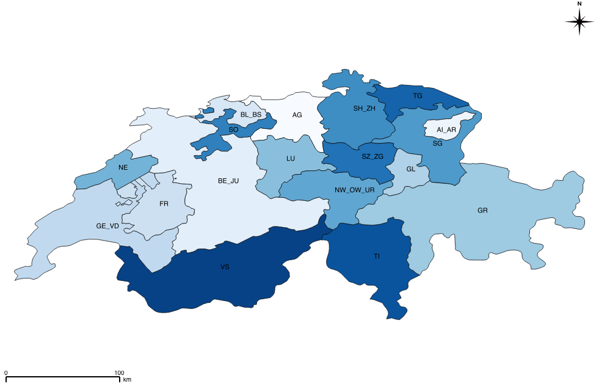

# Swiss-Calliope model

## Installation

To install, it is recommended to follow the [instructions for installing Calliope](http://docs.callio.pe/en/stable/user/installation.html), which includes installation of the [Anaconda Python distribution](https://www.continuum.io/downloads).

The model is compatible with version 0.6 of the Calliope framework.

## Model regions

A shapefile with polygons of the regions used is included.

## Sources

See [Sources](SOURCES.md) for data sources used.

## Acknowledgements

I would like to thank Stefan Pfenninger and Gianfranco Guidati for the help with the model development and the data processing. Furthermore, I would like to thank Tim Tröndle for providing me the Swiss photovoltaics and wind capacity data.

## License

This work is licensed under a [Creative Commons Attribution-ShareAlike 4.0 International License](http://creativecommons.org/licenses/by-sa/4.0/).
